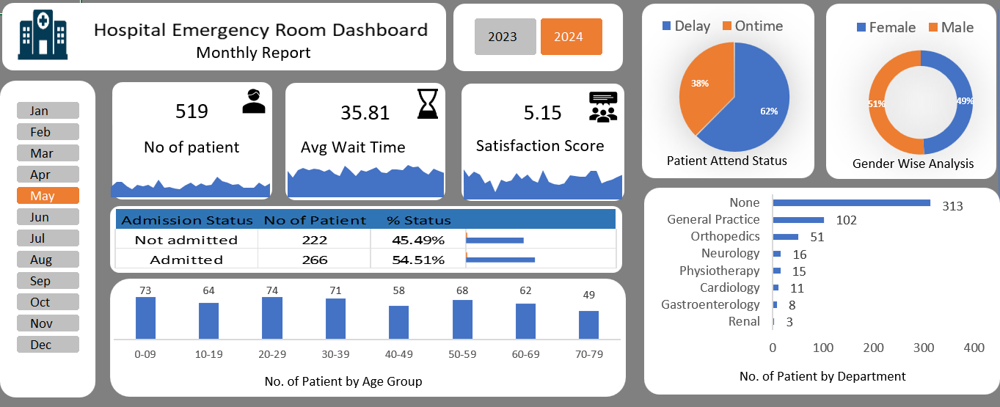

# 🏥 Hospital Emergency Room Dashboard

## 📌 Objective
The objective of this project is to analyze emergency room data to identify patterns in patient flow, waiting time, and hospital efficiency, and to provide actionable insights for better decision-making.

---

## 📊 About Dataset
The dataset contains hospital emergency room records including:
- Patient ID and visit details
- Age and gender of patients
- Admission status (Admitted / Not Admitted)
- Department referrals (e.g., Orthopedics, Cardiology)
- Waiting time
- Patient satisfaction scores
- Date and time of visit

This dataset helps in analyzing patient trends and operational performance.

---

## 🛠 Tools & Technologies
- Microsoft Excel
- Power Query (Data Cleaning)
- Power Pivot (Data Modeling)
- DAX (Calculations)
- Data Visualization

---

## 📈 Key KPIs
- Total Patients
- Average Waiting Time
- Patient Satisfaction Score
- Admission Rate (%)
- Department-wise Patient Count

---

## 📊 Dashboard Preview

---

## 🔍 Key Insights

### 1. Patient Admission Trends
- More than half of the patients are admitted
- Indicates high dependency on emergency services

### 2. Waiting Time Analysis
- Average waiting time is relatively high
- Suggests need for better queue management

### 3. Department-wise Referrals
- Certain departments like Orthopedics and General Practice receive more patients
- Helps in resource allocation planning

### 4. Patient Demographics
- Majority patients belong to young and middle-age groups
- Gender distribution is almost balanced

### 5. Timeliness Performance
- A significant percentage of patients experience delays
- Highlights operational inefficiencies

---

## 🚀 Features
- Interactive filters (Month/Year)
- Dynamic KPI tracking
- Department-wise analysis
- Easy-to-understand visualizations

---

## 💡 Business Impact
- Helps reduce patient waiting time
- Improves hospital resource allocation
- Enhances patient satisfaction
- Supports data-driven hospital management decisions

## 👩‍💻 Author
Anshika Patel
